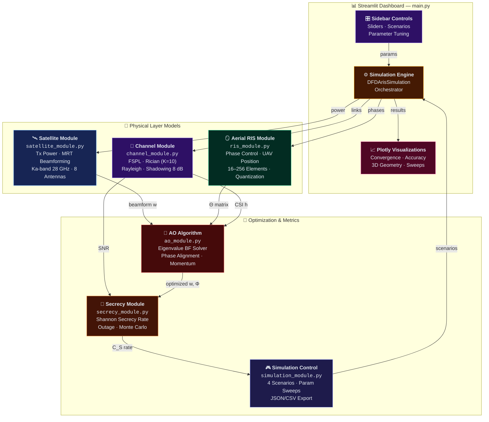

# 🛰️ AO-AERIAL-RIS: Physical Layer Security in Satellite Communication

**Alternating Optimization for Aerial RIS-Enhanced Physical Layer Security in Satellite Communication Systems — with Interactive Streamlit Dashboard**

[](https://www.python.org/downloads/)
[](https://streamlit.io)
[](LICENSE)
[](https://numpy.org)
[](https://scipy.org)

---

## Overview

This project implements a **DFD-ARIS (Distributed Friendly-jamming and Deception via Aerial Reconfigurable Intelligent Surface)** framework for enhancing physical layer security (PLS) in satellite communication systems. It is based on the research presented in *Journal of Information and Intelligence 1 (2023) 54–67*.

A UAV-mounted RIS is jointly optimized with satellite beamforming and cooperative jamming to maximize the secrecy rate of a legitimate downlink while suppressing eavesdropper reception. The system ships with a full-featured **Streamlit dashboard** for interactive parameter tuning, real-time simulation, and rich Plotly-based visualizations.

---

## Key Features

- **Alternating Optimization (AO) Engine** — Iteratively optimizes satellite beamforming vectors and RIS phase-shift matrices using generalized eigenvalue decomposition and phase-alignment strategies with momentum acceleration.
- **Aerial RIS Model** — Configurable UAV-mounted RIS with support for discrete/continuous phase shifts, adjustable element counts (16–256), sub-group partitioning, and 3D position control.
- **Comprehensive Channel Modeling** — Free-space path loss for satellite–RIS links, Rician fading for LoS ground links, Rayleigh fading for NLoS eavesdropper links, and log-normal shadowing — all operating at 28 GHz Ka-band.
- **Physical Layer Security Metrics** — Shannon-capacity-based secrecy rate computation, secrecy outage probability, Monte Carlo analysis, and threshold achievement tracking.
- **Power Optimization** — Three-regime power allocation (balanced / rate-constrained / power-constrained) with cooperative jamming power control.
- **Interactive Streamlit Dashboard** — Real-time parameter sliders, Plotly convergence plots, 3D geometry viewer, accuracy gauges, parameter sensitivity analysis, and scenario comparison.
- **Predefined Scenarios** — Baseline, High Security, Low Power, and Continuous Phase configurations ready to run out of the box.
- **Export & Reporting** — Automatic JSON/CSV result export and a generated simulation report with executive summary, convergence analysis, and performance metrics.

---

## System Architecture



### Data Flow Summary

| Flow | Path | Description |
|------|------|-------------|
| **User Input** | Sidebar → Engine | Parameter sliders and scenario selection feed the simulation |
| **Optimization Loop** | Engine → Physical Models → AO → Secrecy | Alternating optimization of beamforming **w** and phase matrix **Φ** |
| **Results Pipeline** | Secrecy → Simulation → Engine → Visualizations | Secrecy rates, accuracy metrics, and exports rendered in Plotly |
| **Feedback Loop** | Simulation → Engine | Scenario configs and sweep parameters cycle back into the engine |

---

## Repository Structure

```
Satellite Security Enhancement with Aerial RIS/
├── main.py                 # Streamlit dashboard + DFD-ARIS simulation engine
├── run_simulation.py       # CLI-based simulation runner
├── config.py               # Centralized configuration (all system constants)
├── ao_module.py            # Alternating Optimization algorithm
├── satellite_module.py     # Satellite transmitter model
├── ris_module.py           # Aerial RIS (UAV-mounted) model
├── channel_module.py       # Channel modeling (FSPL, Rician, Rayleigh)
├── secrecy_module.py       # Secrecy rate & PLS metrics
├── simulation_module.py    # Simulation control, scenarios, export
├── dashboard_module.py     # Console-based dashboard (fallback UI)
└── requirements.txt        # Python dependencies
```

---

## Installation

### Prerequisites

- Python 3.8 or higher
- pip package manager

### Setup

```bash
# Clone the repository
git clone https://github.com/praveenthangavelu/AO-AERIAL-RIS-WITH-ENHANCED-UI-DASHBORD-FOR-PHYSICAL-LAYER-SECURITY-IN-SATELLITE-COMMUNICATION.git
cd AO-AERIAL-RIS-WITH-ENHANCED-UI-DASHBORD-FOR-PHYSICAL-LAYER-SECURITY-IN-SATELLITE-COMMUNICATION

# Install dependencies
pip install -r "Satellite Security Enhancement with Aerial RIS/requirements.txt"
```

### Core Dependencies

| Package | Version | Purpose |
|---------|---------|---------|
| numpy | ≥ 1.21.0 | Array operations, linear algebra |
| scipy | ≥ 1.7.0 | Eigenvalue solvers, optimization |
| streamlit | latest | Interactive web dashboard |
| plotly | ≥ 5.3.0 | Interactive visualizations |
| pandas | ≥ 1.3.0 | Data analysis and tabulation |
| matplotlib | ≥ 3.4.0 | Fallback plotting (optional) |

---

## Usage

### Launch the Streamlit Dashboard (Recommended)

```bash
cd "Satellite Security Enhancement with Aerial RIS"
streamlit run main.py
```

This opens a browser-based dashboard where you can:

1. **Adjust parameters** via sidebar sliders — RIS elements (N), sub-groups (L), satellite power, jamming power, secrecy/data rate thresholds, and node positions.
2. **Run simulations** with a single click and watch convergence in real time.
3. **Compare scenarios** — DFD-ARIS vs. conventional RIS vs. no-RIS vs. theoretical maximum.
4. **Explore accuracy graphs** — absolute accuracy, relative improvement, power efficiency, phase alignment, jamming efficiency, and secrecy efficiency.
5. **Perform parameter sensitivity analysis** — see how RIS element count, transmit power, eavesdropper distance, sub-group count, and secrecy threshold affect performance.

### Run from the Command Line

```bash
cd "Satellite Security Enhancement with Aerial RIS"
python run_simulation.py
```

The CLI runner executes the baseline scenario, prints convergence progress to the console, and optionally runs a parameter sweep over satellite power, RIS elements, or UAV altitude.

---

## Configuration

All system parameters are centralized in `config.py`. Key configuration blocks:

| Block | What It Controls |
|-------|-----------------|
| `SATELLITE_CONFIG` | Transmit power, Ka-band frequency (28 GHz), GEO orbit position, antenna elements |
| `RIS_CONFIG` | Element count, UAV altitude range (50–500 m), discrete/continuous phases, phase resolution |
| `CHANNEL_CONFIG` | Path-loss exponent, shadowing variance, Rician K-factor, bandwidth (10 MHz), noise figure |
| `OPTIMIZATION_CONFIG` | AO convergence threshold, max iterations, step size, momentum, regularization |
| `SECRECY_CONFIG` | Target secrecy rate, noise power, outage threshold, Monte Carlo trials |
| `SCENARIOS` | Four predefined scenarios (Baseline, High Security, Low Power, Continuous Phases) |

---

## Simulation Scenarios

| # | Name | Sat Power | RIS Elements | Phase Type | Description |
|---|------|-----------|-------------|------------|-------------|
| 1 | Baseline | 100 W | 64 (8×8) | Discrete (4-level) | Standard moderate configuration |
| 2 | High Security | 500 W | 128 | Discrete (8-level) | Optimized for maximum secrecy rate |
| 3 | Low Power | 50 W | 32 | Discrete (2-level) | Energy-efficient configuration |
| 4 | Continuous Phases | 200 W | 64 | Continuous | Ideal RIS with no phase quantization |

---

## Mathematical Background

The system optimizes the following secrecy rate objective:

```
maximize   C_S = [log₂(1 + γ_D) − log₂(1 + γ_E)]⁺
subject to C_D ≥ C_D,th,  C_S ≥ C_S,th,  P_S ≤ P_S,th,  P_J ≤ P_J,max
```

where γ\_D and γ\_E are the SNRs at the legitimate destination and eavesdropper respectively, and the optimization variables are the satellite beamforming vector **w**, RIS phase-shift matrix **Φ**, and power allocation (P\_S, P\_J). The AO framework decomposes this into alternating sub-problems solved via generalized eigenvalue methods (beamforming) and phase-alignment with eavesdropper suppression (RIS).

---

## Sample Results

After running a simulation, the system produces:

- **Secrecy rate convergence curve** showing AO iteration progress
- **With-RIS vs. without-RIS comparison** across varying satellite transmit power
- **Accuracy metrics**: absolute accuracy (% of theoretical max), threshold achievement, power efficiency, phase alignment score
- **Exported files**: `simulation_results_<timestamp>.json` and `secrecy_rates_<timestamp>.csv`

---

## Contributing

Contributions are welcome. To contribute:

1. Fork the repository
2. Create a feature branch (`git checkout -b feature/your-feature`)
3. Commit your changes (`git commit -m 'Add your feature'`)
4. Push to the branch (`git push origin feature/your-feature`)
5. Open a Pull Request

---

## References

- Based on: *Journal of Information and Intelligence*, Vol. 1, 2023, pp. 54–67
- Aerial RIS-aided secure satellite communication with cooperative jamming and alternating optimization

---

## License

This project is open source. See the repository for license details.

---

## Author

**Praveen Thangavelu** — [GitHub Profile](https://github.com/praveenthangavelu)
